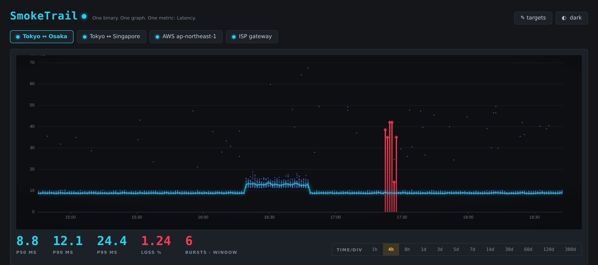

<div align="center">

# SmokeTrail

**Windows has no open-source latency monitor that runs as a service. This is one.**

[](https://github.com/githubflyideas/SmokeTrail/releases)
[](LICENSE)
[](https://go.dev)
[](#build)

[**Download for Windows**](https://github.com/githubflyideas/SmokeTrail/releases/latest) ·
[Why distributions](#it-records-the-shape-not-the-average) ·
[How the Windows port works](#how-the-windows-port-works) ·
[Which of these do I want?](#pingping-fogping-smoketrail--which-one)



</div>

---

## The gap

Windows has excellent throwaway latency tools — Ping Tracer, vmPing, PingInfoView,
`gping`. You open one when something breaks and close it when it stops. It has
PRTG and PingPlotter, which are commercial.

What it does not have is the thing SmokePing is on Linux: **a daemon that watches
a link for months and lets you go back and look at what happened at 03:40 last
Tuesday.**

SmokeTrail is that, as one .exe. No .NET, no runtime, no DLL beside it, no Perl,
no RRDtool, no WSL, no Docker.

```powershell
SmokeTrail.exe            # run it now, console at http://localhost:8518
SmokeTrail.exe install    # run it as a service from now on (asks for elevation)
```

## It records the shape, not the average

A link that averages 20 ms but reaches 400 ms at p99, and a link that sits at a
flat 20 ms, have the same average and nothing else in common. **Averages are where
that difference goes to die**, and most monitoring stores averages.

SmokeTrail keeps **every RTT sample** for the recent window. When it ages data
out it keeps min / p50 / p90 / p99 / max, loss and burst counts per hour — for
**300 days**. Zoom out to a quarter and the smoke is still smoke, not a line.

Loss bursts are flagged with a robust z-score — median plus MAD, Iglewicz–Hoaglin
cutoff — rather than a threshold you have to tune. The chart marks them. You
decide what they meant.

## Install

### Windows

| | |
|---|---|
| **Installer** | [`SmokeTrail-setup.exe`](https://github.com/githubflyideas/SmokeTrail/releases/latest) — registers the service, opens the firewall port, puts an icon in the notification area |
| **Portable** | unzip, double-click. Everything lives in the `data` folder beside the .exe. Nothing is written elsewhere, no registry key is touched, deleting the folder is a complete uninstall |

The portable form is not a lesser option — it is the one that works on a customer
site where you are not allowed to install anything.

**What `install` sets up**

| | |
|---|---|
| account | `NT AUTHORITY\LocalService` with a **per-service SID**, so the database is locked to this service — not to every other LocalService process on the box |
| start | automatic, delayed |
| recovery | restart after 5 s, 20 s, 60 s |
| data | `%ProgramData%\SmokeTrail` |
| firewall | console port, private + domain profiles |
| Defender | an exclusion for the database, because real-time scanning shows up as I/O jitter in the measurements |

Service logs go to the Application event log with filterable event IDs — 1xxx
lifecycle, 2xxx degraded, 3xxx failed to start:

```powershell
Get-WinEvent -ProviderName SmokeTrail -MaxEvents 30
```

The notification area icon raises a notification when a link goes down, and both
it and the web console speak ten languages.

### Linux and macOS

Same binary, same console. `deploy/smoketrail.service` is the systemd unit. ICMP
without root needs one of:

```bash
echo 'net.ipv4.ping_group_range = 0 2147483647' | sudo tee /etc/sysctl.d/99-smoketrail.conf && sudo sysctl --system
# or
sudo setcap cap_net_raw+ep ./smoketrail
```

### First run

There is no default password, no password on the command line, and no config file.
Open the console and the first screen asks you to create the admin account. A
service command line lives in the registry where every account on the machine can
read it, so a credential does not belong there — see [ADR 4](docs/adr/0004-auth.md).

Accounts come in two roles and there are no plans for a third. An **admin** can
change what this host probes; a **viewer** can only look. That line is drawn
where it is because adding a target makes this machine send packets to an address
the requester chose, which is not something to hand out with a "have a look" URL.

## Ten languages

English · 中文 · Español · Français · Português · Русский · Bahasa Indonesia ·
Deutsch · 日本語 · 한국어

The console follows your browser's `Accept-Language` and the notification-area
icon follows the Windows UI language; both have a picker, and the choice is
remembered. One catalogue in `i18n/strings.json` feeds both, so a translator
edits one file and never touches Go or HTML.

Adding a language is one column in that file. Tests refuse to build a release
with an empty string in any language, or with format placeholders that do not
match English — a stray `%d` renders as `%!d(MISSING)` in a notification written
in a language the author cannot read.

## Check the machine before you trust its graphs

```
SmokeTrail.exe selftest
```

SmokeTrail claims sub-millisecond RTT differences are real and worth drawing. That
is only true if the host's clock resolves finely enough and its scheduler wakes
threads on time. Windows historically ran a ~15.6 ms timer tick, which would fail
that badly, and a virtualised server can still be poor today.

```
clock resolution      4.9µs
  PASS  fine enough for sub-millisecond RTT
sleep 50ms   overshoot  p50 1.1144ms  p90 1.3312ms  p99 1.4389ms  max 1.548ms
  PASS  pacing is tight; packets in a round are evenly spaced
ticker drift over 100 ticks of 20ms   602µs total (6.02µs per tick)
  PASS  probe intervals will hold over days
```

Run it once on any machine before trusting what it draws. Ten seconds, and then
you know rather than assume.

## pingping, fogping, SmokeTrail — which one?

Three repositories, one lineage. They share a measurement philosophy and diverge
on where the data goes and who is running them.

| | | |
|---|---|---|
| [**pingping**](https://github.com/githubflyideas/pingping) | **JSONL on disk, nothing else.** No database at all — append-only files you can `grep`, `jq` and rotate with the tools you already have. | For air-gapped boxes, throwaway probes, and anywhere a database is one moving part too many. |
| [**fogping**](https://github.com/githubflyideas/fogping) | **The Linux daemon.** SQLite, two-tier storage, the same console. | For a Linux host you administer yourself, alongside systemd and your existing stack. |
| [**SmokeTrail**](https://github.com/githubflyideas/SmokeTrail) | **The Windows one.** fogping's engine, plus everything a Windows deployment needs: service, installer, notification area, event log, per-service SID. | For Windows servers and desktops — and it still runs on Linux if you want one build everywhere. |

Short version: **on Linux, fogping. On Windows, SmokeTrail. Without a database,
pingping.**

## How the Windows port works

Five decisions, each written up because the reasoning is the part worth reading.

| | |
|---|---|
| [ADR 1](docs/adr/0001-sqlite-driver.md) | Pure-Go SQLite, so `CGO_ENABLED=0` holds and cross-compiling needs no toolchain |
| [ADR 2](docs/adr/0002-windows-icmp.md) | `IcmpSendEcho2`, not a raw socket — and why its `RoundTripTime` field is unusable |
| [ADR 3](docs/adr/0003-windows-service.md) | LocalService, not LocalSystem |
| [ADR 4](docs/adr/0004-auth.md) | First-run setup, not credentials on argv |
| [ADR 5](docs/adr/0005-portable-and-installed.md) | One binary, two personalities, one directory decides |
| [ADR 6](docs/adr/0006-windows-citizenship.md) | Version resource, icon, manifest, self-elevation, per-service SID, failure actions, event IDs |

The short version of the interesting one: **`ICMP_ECHO_REPLY.RoundTripTime` is a
`ULONG` of milliseconds.** For a tool that draws distributions, that quantises a
healthy LAN into a staircase of 0s and 1s — the "distribution" would be an
artifact of the API. SmokeTrail ignores the field and times the call itself
against `QueryPerformanceCounter`. A measured loopback target reads p50 0.135 ms,
p99 0.274 ms; every one of those rounds to 0 or 1 in a millisecond field.

## Build

```bash
go mod tidy
go build .                                             # host
CGO_ENABLED=0 GOOS=windows GOARCH=amd64 go build .     # windows
```

That is the whole cross-compile story, and keeping it that way is what ADR 1 buys.
The installer is built with `makensis`, which also runs on Linux, so a release —
binaries and setup.exe — comes out of one Ubuntu job with no Windows runner
anywhere in it.

`resource_windows.syso` is the one binary committed to this repository: the
version resource, icon and application manifest, so a plain `go build` produces a
properly stamped .exe with no extra tooling. It is regenerated by
`packaging/gen-resource.sh`, and the icon comes from
`packaging/icon/make_icon.py` rather than being an opaque blob.

## Verification status

Being precise about this, because "it compiles" and "it works" are different
claims.

**Run, passing** — Linux build and the full test suite; `go vet` on windows/amd64,
windows/386 and linux; cross-compilation for all six release targets with
`CGO_ENABLED=0`; the console end to end, from first-run setup through login,
target creation, live probing and graceful shutdown; `selftest` on both platforms;
the `IcmpSendEcho2` signature and `ICMP_ECHO_REPLY` layout checked against
Microsoft's documentation and pinned by a test that runs on every Windows CI job.

**Not yet exercised on real Windows hardware** — the service lifecycle under
load, Explorer restart recovery for the notification icon, and long-run retention
behaviour. Issues and `selftest` output from real machines are the most useful
thing you can send.

## Contributing

Issues and pull requests are welcome. The most useful contribution right now is
**`selftest` output from a real machine**, especially a virtualised Windows
Server — that is the one measurement this project cannot make for itself.

Release process: [RELEASING.md](RELEASING.md).

## Credits

The probe engine, storage tiering and chart come from
[fogping](https://github.com/githubflyideas/fogping). Inspired by
[SmokePing](https://oss.oetiker.ch/smokeping/) (Tobias Oetiker, Niko Tyni); no
code is shared with it and this project is not affiliated with it.

Apache License 2.0 — see [LICENSE](LICENSE) and [NOTICE](NOTICE).
